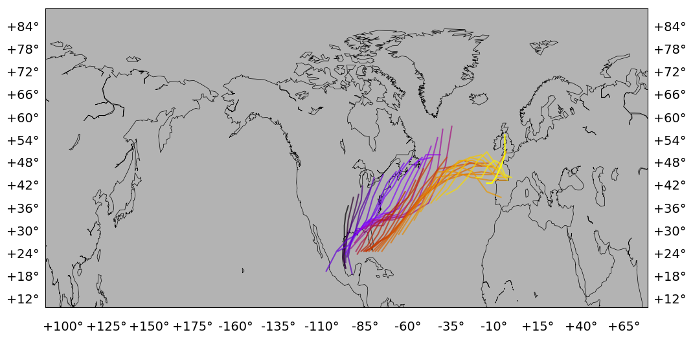

# Atmospheric River (AR) detection and tracking algorithms


## Dependencies

* Python2.7 or Python3.7.
* CDAT (Climatic Data Analysis Tool): (https://github.com/CDAT/cdat).
* numpy (developed in 1.16.5 in py2, tested 1.18.1 in py3)
* scipy (developed in 1.2.1 in py2, tested 1.4.1 in py3)
* matplotlib (2.2.3 for both py2 and py3, having [issues](https://github.com/matplotlib/matplotlib/issues/12820) with 3.1.3)
* basemap (developed in 1.2.0 in py2, tested 1.2.0 in py3)
* pandas (developed in 0.23.4 in py2, tested 1.0.3 in py3)
* networkx (developed in 1.11 and 2.2 in py2, tested 2.4 in py3)
* scikit-image (developed in 0.14.2 in py2, tested 0.16.2 in py3)


## Installation

Recommend building the Python environment using [Anaconda](https://www.anaconda.com/distribution/).

After Anaconda installation, create a working environment:

```
conda create -n ar python=3.7
conda activate ar
```

This creates a Python environment named "ar" with Python version 3.7.

Then install the above listed dependencies, e.g.

```
conda install numpy
```

This installs the current latest version of `numpy`. Most likely the latest versions will work, in case of compatibility issues, consider forcing a given version of a package, e.g.

```
conda install matplotlib=2.2.3
```

For installation of `CDAT`, checkout the [installation guides](https://github.com/CDAT/cdat/wiki/Install). This is likely the most difficult package to install, and consider leaving it to the end. To verify the CDAT installation, in a python session:

```
import cdms2
import MV2
import cdutil
```

If nothing prints out, the installation is successful. In case of errors, also consider their [partial installation instructions](https://github.com/CDAT/cdat/wiki/Additional-Installation-Configurations). Only the `cdms2` and `cdutil` modules are needed, the `vcs` module is not required.

Lastly, get a copy of this repository, either by doing a `git clone`:

```
git clone git@github.com:ihesp/AR_tracker.git
```

or download a `zip` archive of the repository by clicking on the **Clone or download** button, then extract the contents of the `zip` file into a folder named `AR_tracker`.

The package at the moment does not perform any installation, computations are done by executing the Python scripts inside the `AR_tracker` directory.


## Documentation

Further documentation can be found at [https://ar-tracker.readthedocs.io/en/latest/](https://ar-tracker.readthedocs.io/en/latest/).


## Example use case


|  |
| :--: |
|*(a) The IVT field in kg/m/s at 1984-01-26 00:00 UTC over the North Hemisphere. (b) the IVT reconstruction field (IVT_rec) at the same time point. (c) the IVT anomaly field (IVT_ano) from the THR process at the same time point.*|

|  |
| :--: |
|*Locations of a track labelled "198424" found in year 1984. Black to yellow color scheme indicates the evolution.*|


## Inventory

* utils/func.py: general purpose functions.
* utils/plot.py: plotting functions.
* utils/rdp.py: Ramer-Douglas-Peucker algorithm.
* utils/peak_prominence2d.py: Separate local peaks using peak prominence.
* compute_thr_singlefile.py: compute THR on IVT data. Process a single file.
* compute_thr_multifile.py: compute THR on IVT data. Process multiple files.
* river_tracker1.py: detect ARs on individual time steps. Requires outputs from `compute_thr.py`.
* river_tracker2.py: track individual AR records across time. Requires outputs from `river_tracker1.py`.
* river_tracker1_funcs.py: utility functions used in `river_tracker1.py`.
* test_data.py: utility script to check input netcdf file sanity.
* docs: readthedocs documentation.
* notebooks: a series of jupyter notebooks illustrating the major functionalities of the package.


## Contribution

If you encounter problems or would like to help improve the code, please don't
hesitate to fire up an issue or pull request.


